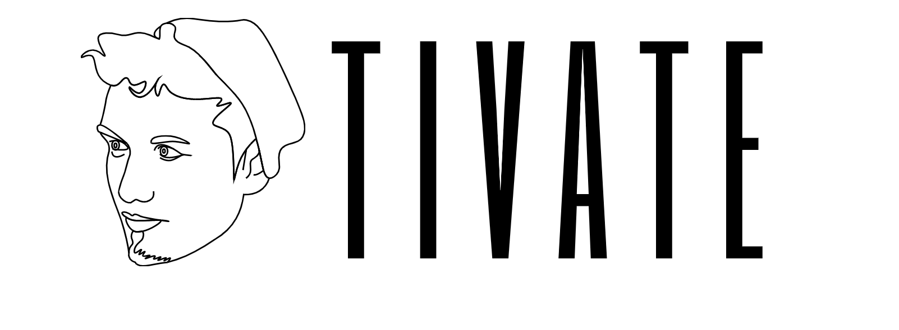

# www.moezzaman.com

A frontend resume website built for a client with a focus on minimal and modern design. Built with React.js.

## Technologies
* Bootstrapped with [create-react-app](https://github.com/facebook/create-react-app)
* Routed with [react-router](https://github.com/ReactTraining/react-router)
* SVGs drawn in Adobe Illustrator
* SVG and CSS animations with [animejs](https://animejs.com/)
* [EmailJS](https://www.emailjs.com/)
* Deployed with Github Pages ([www.moezzaman.com](https://moezzaman.com))

## Tested
* Tested on Google Chrome and Opera
* Responsive mobile design tested on Safari and Google Chrome

## License
[MIT](https://choosealicense.com/licenses/mit/)